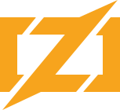

<!-- PROJECT SHIELDS -->
<!--
*** I'm using markdown "reference style" links for readability.
*** Reference links are enclosed in brackets [ ] instead of parentheses ( ).
*** See the bottom of this document for the declaration of the reference variables
*** for contributors-url, forks-url, etc. This is an optional, concise syntax you may use.
*** https://www.markdownguide.org/basic-syntax/#reference-style-links
-->
<div align="left">

[![Contributors][contributors-shield]][contributors-url]
[![Forks][forks-shield]][forks-url]
[![Stargazers][stars-shield]][stars-url]

</div>

<a href="https://kaweees.github.io/kiwiRTOS">
  
</a>

<div align="left">
  <h1><em><a href="https://kaweees.github.io/kiwiRTOS">~kiwiRTOS</a></em></h1>
</div>

<!-- ABOUT THE PROJECT -->

A minimal Real-Time Operating System (RTOS) designed for embedded applications with targets for x86_64, RISC-V (RV32I, RV64I) and ARM written in Zig.

### Built With

[![Zig][Zig-shield]][Zig-url]
[![NixOS][NixOS-shield]][NixOS-url]
[![GitHub Actions][github-actions-shield]][github-actions-url]

<!-- PROJECT PREVIEW -->
## Preview

<p align="center">
  
</p>

<!-- GETTING STARTED -->

## Getting Started

### Prerequisites

Before attempting to build this project, make sure you have [Zig](https://ziglang.org/learn/getting-started/) and [Nix](https://nixos.org/download.html) installed on your machine.

### Installation

To get a local copy of the project up and running on your machine, follow these simple steps:

1. Clone the project repository

   ```sh
   git clone https://github.com/Kaweees/kiwiRTOS.git
   cd kiwiRTOS
   ```

2. Install the project dependencies

   ```sh
   nix-shell
   ```

3. Run the project

   ```sh
   just run <architecture>
   ```

<!-- PROJECT FILE STRUCTURE -->

## Project Structure

```sh
.kiwiRTOS/
├── .github/                       - GitHub Actions CI/CD workflows
├── build.zig                      - Zig build file
├── src/                           - Project packages
│   ├── arch/                      - Architecture specific code
│   │   ├── x86_64/                  - x86_64 architecture specific code
│   │   ├── riscv/                   - RISC-V architecture specific code
│   │   └── arm/                     - ARM architecture specific code
│   ├── drivers/                   - Device drivers
│   ├── kernel/                    - Kernel code
│   ├── lib/                       - Library code
│   └── tests/                     - Project tests
├── LICENSE                        - Project license
└── README.md                      - You are here
```

## License

The source code for this project is distributed under the terms of the GNU General Public License v3.0, as I firmly believe that collaborating on free and open-source software fosters innovations that mutually and equitably beneficial to both collaborators and users alike. See [`LICENSE`](./LICENSE) for details and more information.

<!-- MARKDOWN LINKS & IMAGES -->
<!-- https://www.markdownguide.org/basic-syntax/#reference-style-links -->

[contributors-shield]: https://img.shields.io/github/contributors/Kaweees/kiwiRTOS.svg?style=for-the-badge
[contributors-url]: https://github.com/Kaweees/kiwiRTOS/graphs/contributors
[forks-shield]: https://img.shields.io/github/forks/Kaweees/kiwiRTOS.svg?style=for-the-badge
[forks-url]: https://github.com/Kaweees/kiwiRTOS/network/members
[stars-shield]: https://img.shields.io/github/stars/Kaweees/kiwiRTOS.svg?style=for-the-badge
[stars-url]: https://github.com/Kaweees/kiwiRTOS/stargazers

<!-- MARKDOWN SHIELD BAGDES & LINKS -->
<!-- https://github.com/Ileriayo/markdown-badges -->

[Zig-shield]: https://img.shields.io/badge/Zig-%f7a41d.svg?style=for-the-badge&logo=zig&logoColor=f7a41d&labelColor=222222&color=f7a41d
[NixOS-shield]: https://img.shields.io/badge/NIX-%23008080.svg?style=for-the-badge&logo=NixOS&logoColor=5277C3&labelColor=222222&color=5277C3
[NixOS-url]: https://nixos.org/
[Zig-url]: https://ziglang.org/
[github-actions-shield]: https://img.shields.io/badge/github%20actions-%232671E5.svg?style=for-the-badge&logo=githubactions&logoColor=2671E5&labelColor=222222&color=2671E5
[github-actions-url]: https://github.com/features/actions
